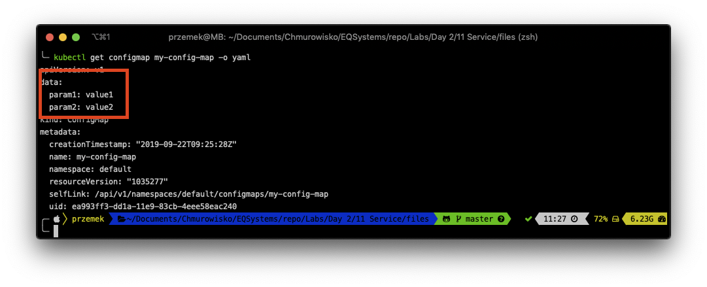
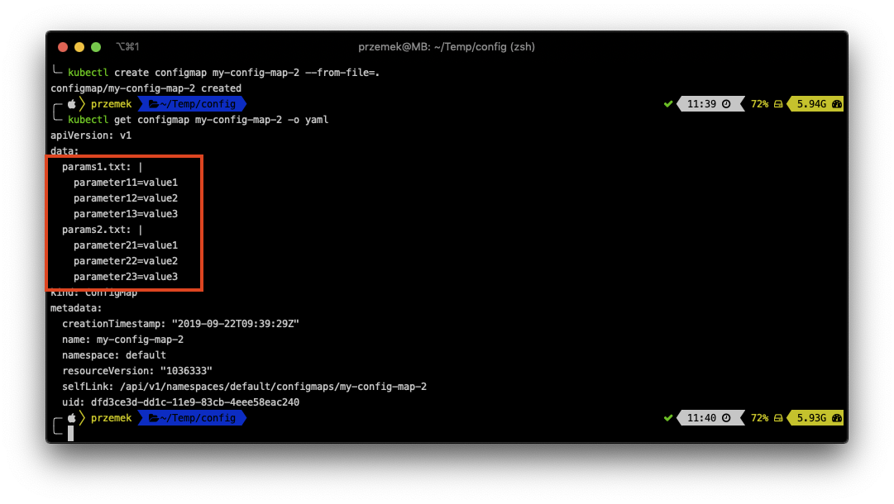
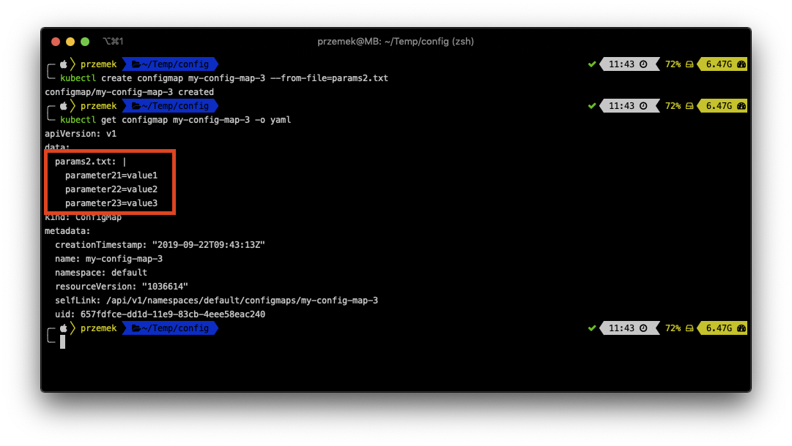
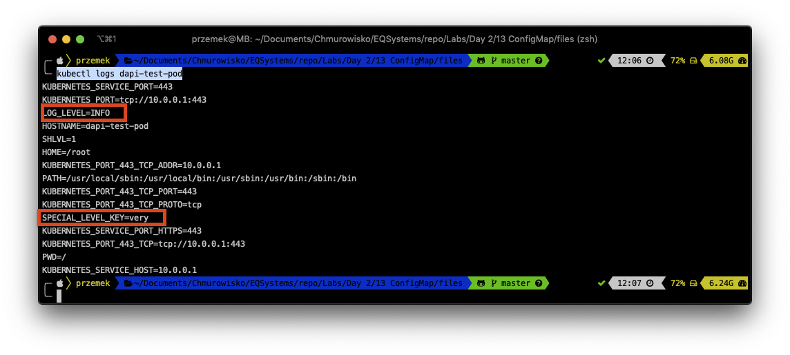
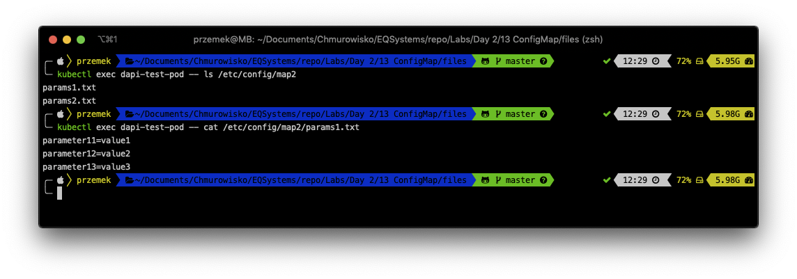

<br><br>
<br><br>
<br><br>

# ConfigMaps

## LAB Overview

#### In this lab you will work with ConfigMaps

ConfigMaps are used to pro‐ vide configuration information for workloads. This can either be fine-grained infor‐ mation (a short string) or a composite value in the form of a file.

## Task 1: Creating a ConfigMap from literal

1. Run following command to create a simple ConfigMap from literal:
``kubectl create configmap my-config-map --from-literal=param1=value1 --from-literal=param2=value2``
2. Get the config map using: ``kubectl get configmap my-config-map -o yaml``


## Task2: Creating a ConfigMap from directories and files

1. Create a new directory ``mkdir config`` and enter it ``cd config``
2. Create two paremeter files running:
```
cat <<EOT >> params1.txt
parameter11=value1
parameter12=value2
parameter13=value3
EOT
```
and
```
cat <<EOT >> params2.txt
parameter21=value1
parameter22=value2
parameter23=value3
EOT
```
3. Still in the *config* directory run: 
``
kubectl create configmap my-config-map-2 --from-file=.
``
and check the ConfigMap:``kubectl get configmap my-config-map-2 -o yaml``


You can also create a ConfigMap from one file.

4. Run ``kubectl create configmap my-config-map-3 --from-file=params2.txt``
and check the ConfigMap ``kubectl get configmap my-config-map-3 -o yaml``


## Task 3: Creating ConfigMap using Manifest File

1. Create a new file by running ``nano cm.yaml``.
2. Download [manifest file](./files/cm.yaml) and paste its contents to editor window.
3. Save changes by pressing *CTRL+O* and *CTRL-X*.
4. Create ConfigMap by running: ``kubectl apply -f cm.yaml``

## Task 4: Using ConfigMap as container environment variables.

You will create a Pod with two environment variables.

1. Create a new file by running ``nano pod.yaml``.
2. Download [manifest file](./files/pod.yaml) and paste its contents to editor window.
3. Save changes by pressing *CTRL+O* and *CTRL-X*.
4. Create a Pod by running: ``kubectl apply -f pod.yaml``

The Pod echoed its env variables.

5. Check the logs of the Pod: ``kubectl logs dapi-test-pod`` and you should see two env variables defined in your config maps.


6. Delete the pod: ``kubectl delete pod dapi-test-pod``
## Task 5: Adding ConfigMap data to a Volume

When you create a ConfigMap using *--from-file*, the filename becomes a key stored in the data section of the ConfigMap. The file contents become the key’s value.

You will create a Pod with  config map mounted as file.

1. Create a new file by running ``nano pod-files.yaml``.
2. Download [manifest file](./files/pod-files.yaml) and paste its contents to editor window.
3. Save changes by pressing *CTRL+O* and *CTRL-X*.
4. Create a Pod by running: ``kubectl apply -f pod-files.yaml``

This time, the Pod echoed the list of files inside */etc/config* directory.

5. Check the logs of the Pod: ``kubectl logs dapi-test-pod``


The Pod is still running, so you can exec a few commands inside it

6. Get the list of files inside *map2* directory: ``kubectl exec dapi-test-pod -- ls /etc/config/map2``
7. Get the cobtent of *params1.txt* file: ``kubectl exec dapi-test-pod -- cat /etc/config/map2/params1.txt``


7. Please delete the Pod: ``kubectl delete pod dapi-test-pod`` and ConfigMaps ``delete --all configmaps``
## END LAB

<br><br>

<center><p>&copy; 2019 Chmurowisko Sp. z o.o.<p></center>
