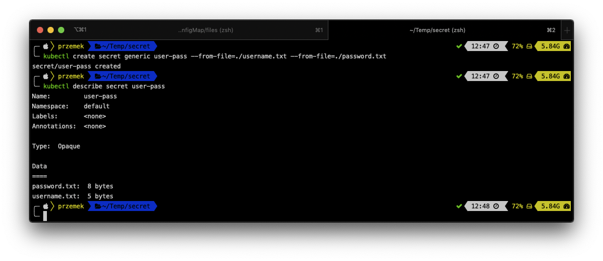
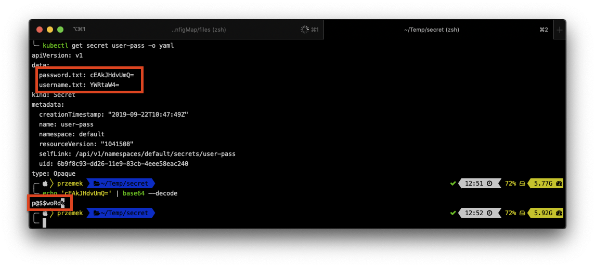
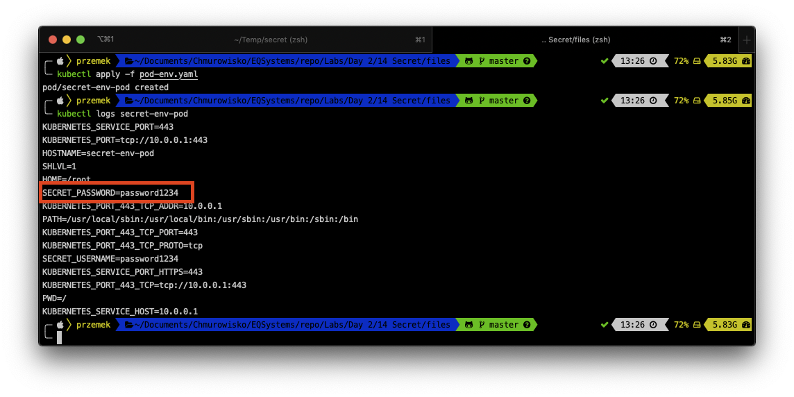

  
  
  

# Secrets

## LAB Overview

#### In this lab you will work with Secrets

Secrets enable container images to be created without bundling sensitive data. This allows containers to remain portable across environments

## Task1: Creating a Secret from files

1. Create a new directory ``mkdir secret`` and enter it ``cd secret``
2. Create two files running:

``
echo -n 'admin' > ./username.txt
``

and

``
echo -n 'p@$$woRd' > ./password.txt
``
3. Still in the *secret* directory run: 

``
kubectl create secret generic user-pass --from-file=./username.txt --from-file=./password.txt
``

and check the Secret: 

``kubectl describe secret user-pass``

*kubectl get* and *kubectl describe* avoid showing the contents of a secret by default. This is to protect the secret from being exposed accidentally to an onlooker, or from being stored in a terminal log.

4. To decode a secret run:

``
kubectl get secret user-pass -o yaml
``

and decode the passrodd

``
echo 'cEAkJHdvUmQ=' | base64 --decode
``

## Task 2: Creating Secret using a Manifest File

1. Create a new file by running ``nano secret.yaml``.
2. Download [manifest file](./files/secret.yaml) and paste its contents to editor window.
3. Save changes by pressing *CTRL+O* and *CTRL-X*.
4. Create a Secret by running: 

``kubectl apply -f secret.yaml``

and check the Secret: 

``kubectl describe secret mysecret``

# Task 2: Using Secret from a Pod as a Volume

1. Create a new file by running ``nano pod-volume.yaml``.
2. Download [manifest file](./files/pod-volume.yaml) and paste its contents to editor window.
3. Save changes by pressing *CTRL+O* and *CTRL-X*.
4. Create a pod by running: 

``
kubectl apply -f pod-volume.yaml
``

5. The Pod echoed list of files so let's look into its logs:

``
kubectl logs mypod
``

6. Now you can read the password simply by executing:

``
kubectl exec mypod -- cat /etc/foo/password
``

7. Delete the Pod:

``
kubectl delete pod mypod
``

## Task 3: Using Secrets as Environment Variables

1. Create a new file by running ``nano pod-env.yaml``.
2. Download [manifest file](./files/pod-env.yaml) and paste its contents to editor window.
3. Save changes by pressing *CTRL+O* and *CTRL-X*.
4. Create a pod by running: 

``
kubectl apply -f pod-env.yaml
``
5. The Poed echoed its env variables, so you can check if passwprd secred was decoded:

``
kubectl logs secret-env-pod
``

6. Please, delete the Pod
``kubectl delete pod secret-env-pod`` and secrets ``kubectl delete secrets --all``

## END LAB

  

&copy; 2019 Chmurowisko Sp. z o.o.

