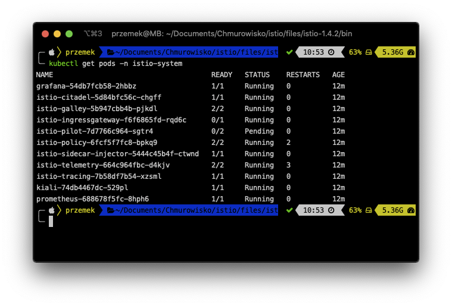

<br><br>
<br><br>
<br><br>

# Installing Istio

## LAB Overview

#### In this lab you will install Istio

## Task 1: Creating namespace for Istio

1. Open a terminal of your choice.
2. Type ``kubectl create namespace istio-system`` and press **Enter**.

## Task 2: Creating secrets for Grafana and Kiali

1. Still in the terminal set two variables by typing:
```
GRAFANA_USERNAME=$(echo -n "grafana" | base64)
GRAFANA_PASSPHRASE=$(echo -n "REPLACE_WITH_YOUR_SECURE_PASSWORD" | base64)
```
2. Create Grafana secret:
```
cat <<EOF | kubectl apply -f -
apiVersion: v1
kind: Secret
metadata:
  name: grafana
  namespace: istio-system
  labels:
    app: grafana
type: Opaque
data:
  username: $GRAFANA_USERNAME
  passphrase: $GRAFANA_PASSPHRASE
EOF
```
3. Set next two variables by typing:
```
KIALI_USERNAME=$(echo -n "kiali" | base64)
KIALI_PASSPHRASE=$(echo -n "REPLACE_WITH_YOUR_SECURE_PASSWORD" | base64)
```
4. Create Kiali secret
```
cat <<EOF | kubectl apply -f -
apiVersion: v1
kind: Secret
metadata:
  name: kiali
  namespace: istio-system
  labels:
    app: kiali
type: Opaque
data:
  username: $KIALI_USERNAME
  passphrase: $KIALI_PASSPHRASE
EOF
```

## Task 3: Downloading Istio

1. Check the latest version of Istio by visiting [https://github.com/istio/istio/releases](Github page).
2. Set variable to the latest version of Istio:
```
ISTIO_VERSION=latest version
```
3. Download and untar Istio.
* MAC OS
```
curl -sL "https://github.com/istio/istio/releases/download/$ISTIO_VERSION/istio-$ISTIO_VERSION-osx.tar.gz" | tar xz
```
* Linux
```
curl -sL "https://github.com/istio/istio/releases/download/$ISTIO_VERSION/istio-$ISTIO_VERSION-linux.tar.gz" | tar xz
```

* Windows
```
[Net.ServicePointManager]::SecurityProtocol = "tls12"
$ProgressPreference = 'SilentlyContinue'; Invoke-WebRequest -URI "https://github.com/istio/istio/releases/download/$ISTIO_VERSION/istio-$ISTIO_VERSION-win.zip" -OutFile "istio-$ISTIO_VERSION.zip"
Expand-Archive -Path "istio-$ISTIO_VERSION.zip" -DestinationPath .
```

4. Change dir to <istiopath>/bin/

## Task 4: Istalling Istio on AKS cluster

1. Create a new file called *istio.aks.yaml* with the following content:
```
apiVersion: install.istio.io/v1alpha2
kind: IstioControlPlane
spec:
  # Use the default profile as the base
  # More details at: https://istio.io/docs/setup/additional-setup/config-profiles/
  profile: default
  values:
    global:
      # Ensure that the Istio pods are only scheduled to run on Linux nodes
      defaultNodeSelector:
        beta.kubernetes.io/os: linux
      # Enable mutual TLS for the control plane
      controlPlaneSecurityEnabled: true
      mtls:
        # Require all service to service communication to have mtls
        enabled: false
    grafana:
      # Enable Grafana deployment for analytics and monitoring dashboards
      enabled: true
      security:
        # Enable authentication for Grafana
        enabled: true
    kiali:
      # Enable the Kiali deployment for a service mesh observability dashboard
      enabled: true
    tracing:
      # Enable the Jaeger deployment for tracing
      enabled: true
```
2. Istall Istio by executing following command:
```
istioctl manifest apply -f istio.aks.yaml
```
As a result you should get somethinf similiar to the following snippet:
```
Preparing manifests for these components:
- Citadel
- Grafana
- Kiali
- IngressGateway
- Pilot
- Policy
- Injector
- Base
- CoreDNS
- PrometheusOperator
- Cni
- Galley
- NodeAgent
- CertManager
- Prometheus
- Telemetry
- EgressGateway
- Tracing

Applying manifest for component Base
Finished applying manifest for component Base
Applying manifest for component Tracing
Applying manifest for component Kiali
Applying manifest for component Policy
Applying manifest for component IngressGateway
Applying manifest for component Pilot
Applying manifest for component Telemetry
Applying manifest for component Citadel
Applying manifest for component Prometheus
Applying manifest for component Galley
Applying manifest for component Injector
Applying manifest for component Grafana
Finished applying manifest for component Kiali
Finished applying manifest for component Citadel
Finished applying manifest for component Tracing
Finished applying manifest for component Prometheus
Finished applying manifest for component Galley
Finished applying manifest for component Injector
Finished applying manifest for component IngressGateway
Finished applying manifest for component Grafana
Finished applying manifest for component Policy
Finished applying manifest for component Pilot
Finished applying manifest for component Telemetry

Component Prometheus installed successfully:
============================================
Component Telemetry installed successfully:
===========================================
Component EgressGateway installed successfully:
===============================================
Component Tracing installed successfully:
=========================================
Component Injector installed successfully:
==========================================
Component Base installed successfully:
======================================
Component Citadel installed successfully:
=========================================
Component Grafana installed successfully:
=========================================
Component Kiali installed successfully:
=======================================
Component IngressGateway installed successfully:
================================================
Component Pilot installed successfully:
=======================================
Component Policy installed successfully:
========================================
Component CoreDNS installed successfully:
=========================================
Component PrometheusOperator installed successfully:
====================================================
Component Cni installed successfully:
=====================================
Component Galley installed successfully:
========================================
Component NodeAgent installed successfully:
===========================================
Component CertManager installed successfully:
=============================================
```

## Task 5: Validating Istio installation
1. Execute following command:
```
kubectl get svc -n istio-system
```
As a result you should get a snippet similiar to:


If the *istio-ingressgateway* shows an external ip of <pending>, wait a few minutes until an IP address has been assigned by Azure networking.

2. Execute following command:
```
kubectl get pods -n istio-system
```
As a result you should get a snippet similiar to:

All of the pods should show a status of *Running*.
3. Still in the *bin* directory execute following commands to open:
* Grafana ``istioctl dashboard grafana``
* Kiali ``istioctl dashboard kiali``
* Jaeger ``istioctl dashboard jaeger``
* Envoy ``istioctl dashboard envoy <pod-name>.<namespace>``

## END LAB

<br><br>

<center><p>&copy; 2019 Chmurowisko Sp. z o.o.<p></center>
