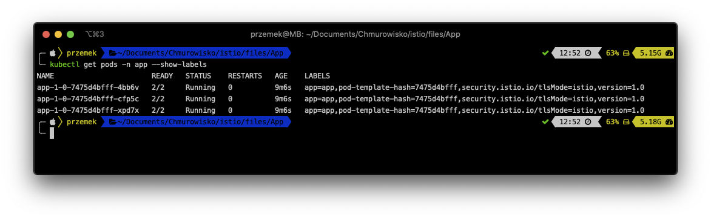
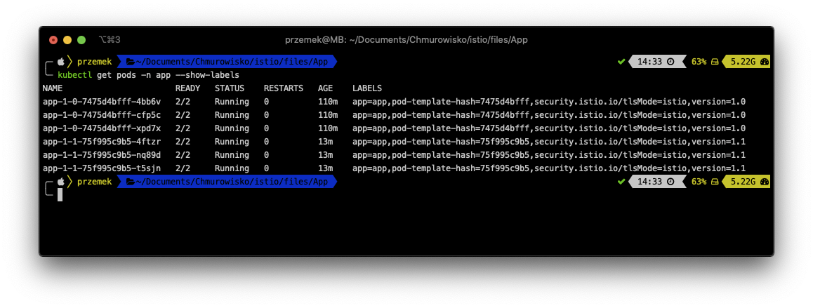

<br><br>
<br><br>
<br><br>

# Deploying app using Istio

## LAB Overview

#### In this lab you will deploy an app using canary deployment

## Task 1: Creating namespace the app

1. Open a terminal of your choice.
2. Type ``kubectl create namespace app`` and press **Enter**.
3. Label the namespace with *istio-injection=enabled*. This label instructs Istio to automatically inject the istio-proxies as sidecars into all of your pods in this namespace.
```
kubectl label namespace app istio-injection=enabled
```

## Task 2: Deploying the application
1. Download [deployment manifest file](files/1_deployment.yaml) and execute:
```
kubectl apply -f 1_deployment.yaml -n app
```
Now you should have the first version of the app deployed to the AKS cluster.
2. Examine the pods by executing:
```
kubectl get pods -n app --show-labels
```


## Task 3: Creating Virtual Service and a Gateway

1. Download [manifest file](files/2_gateway.yaml) and execute followig command:
```
kubectl apply -f 2_gateway.yaml -n app
```
Now you should have both virtual service and gateway created.
2. Obtain the external IP of your ingress. You can find it using following methods:
* execute following command
```
kubect get svc -n istio-system
```
and look for External IP address of *istio-ingressgateway* service
* or execute this command:
```
kubectl get service istio-ingressgateway --namespace istio-system -o jsonpath='{.status.loadBalancer.ingress[0].ip}'
```
3. Open any browser of your choice and try connecting to that IP address. You should get following web page


## Task 4: Deploying new version of the app

1. Download [manifest file](files/3_deployment_update.yaml) and execute following command:
```
kubectl apply -f 3_deployment_update.yaml -n app
```
2. Get the list of running pods:
```
kubectl get pods -n app --show-labels
```
As you can see, now you have both old and new version deployed.

3. Try refreshing the web page. You shoulb be routed to both version of the app.

## Task 5: Canary testing

1. Download [manifest file](files/4_ver2_20.yaml).
2. Examine the file. You will create a destination tule and update existing virtual service for the app.
Now we want to send 20% of the traffic to version 2 and 80% of the traffic to version 1.
3. Execute following command:
```
kubectl apply -f 4_ver2_20.yaml -n app
```
## Task 6: Sending all requests to version 2

1. 1. Download [manifest file](files/4_ver2_all.yaml).
3. Execute following command:
```
kubectl apply -f 4_ver2_all.yaml -n app
```

## END LAB

<br><br>

<center><p>&copy; 2019 Chmurowisko Sp. z o.o.<p></center>
