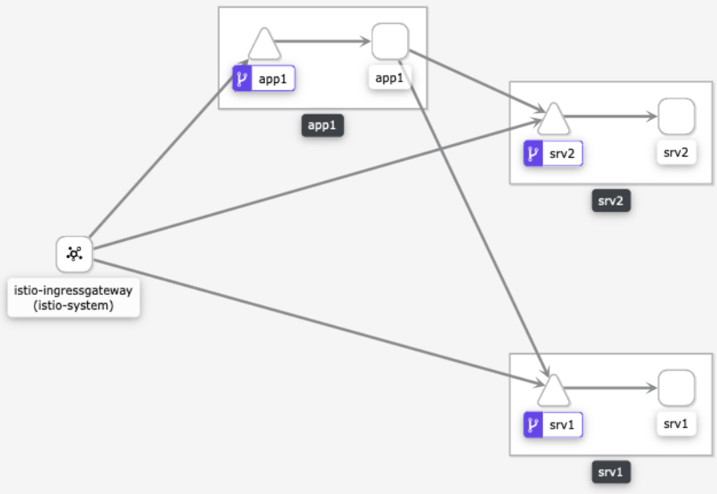

<br><br>
<br><br>
<br><br>

# HTTP Authorization

## LAB Overview

#### In this lab you will add a HTTP authorization for your services



## Task 1: Securing all services

1. Open any browser of your choice and open following urls:
* ``<YOUR-INGRESS-IP>/app1``
* ``<YOUR-INGRESS-IP>/srv1``
* ``<YOUR-INGRESS-IP>/srv2``
All services should still be accessible.
2. Download [deny all traffic manifest file](files/1_deny_all.yaml) and applu it to the cluster by executing
```
kubectl apply -f 1_deny_all.yaml
```
3. Try refreshing the web page in the browser. After a while, you should get a **RBAC: access denied** error.

## Task 2: Opening *app1* to the world
1. Doanload [a manifest file](files/2_app1_view.yaml) and apply it to the cluster by executing:
```
kubectl apply -f 2_app1_view.yaml
```
2. Try refreshing the web page. *app1* should be accessible, but both *srv1* and *srv2* not.

## Task 3: Turning on mTLS for the mesh

1. Download [a manifest file](files/3_global_mTLS.yaml) and apply it:
```
kubectl apply -f 3_global_mTLS.yaml
```
2. Add destination rules for your pods by applying this [manifest file](files/4_mTLS-destination_rules.yaml). [Dowload it](files/4_mTLS-destination_rules.yaml) and apply by executing:
```
kubectl apply -f 4_mTLS-destination_rules.yaml
```

## Task 4: Opening *srv1* and *srv2* for the *app1* service.

1. Download [a manifest file](files/5_service1.yaml) and apply it by executing:
```
kubectl apply -f 5_service1.yaml
```
Now, when you refresh the web page ``<YOUR-INGRESS-IP>/app1`` there should be the answer from *srv1* included in the response.

2. For *srv2* download [this manifest file](files/6_service2.yaml) and apply it by executing:
```
kubectl apply -f 6_service2.yaml
```
Now, there should be both *sr1* and *srv2* responses included.

Try opening ``<YOUR-INGRESS-IP>/srv1`` and ``<YOUR-INGRESS-IP>/srv2``. You should get the **RBAC: access denied** error.

## Task 5: Cleaning up.
1. Remove all authorization policies by executing following commands:
* kubectl delete -f 1_deny_all.yaml
* kubectl delete -f 2_app1_view.yaml
* kubectl delete -f 3_global_mTLS.yaml
* kubectl delete -f 4_mTLS-destination_rules.yaml
* kubectl delete -f 5_service1.yaml
* kubectl delete -f 6_service2.yaml
## END LAB

<br><br>
<center><p>&copy; 2019 Chmurowisko Sp. z o.o.<p></center>
